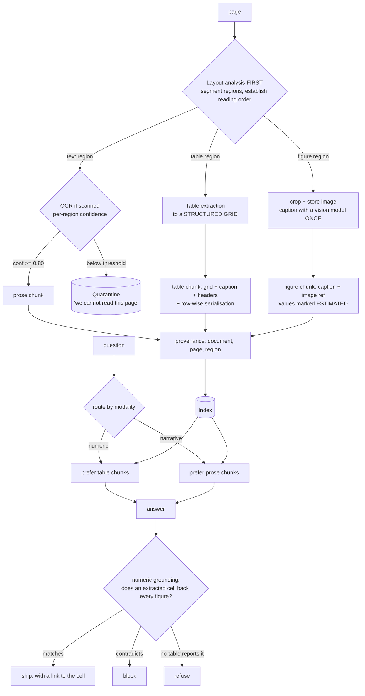
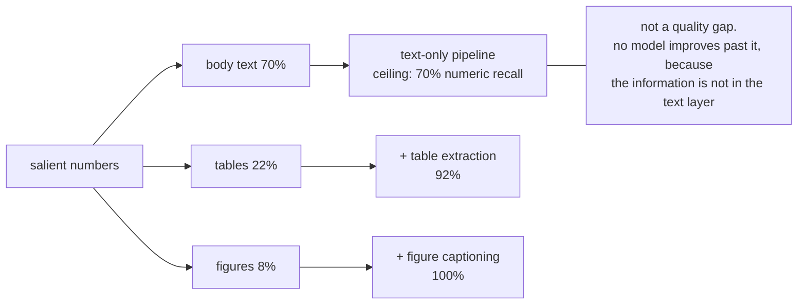
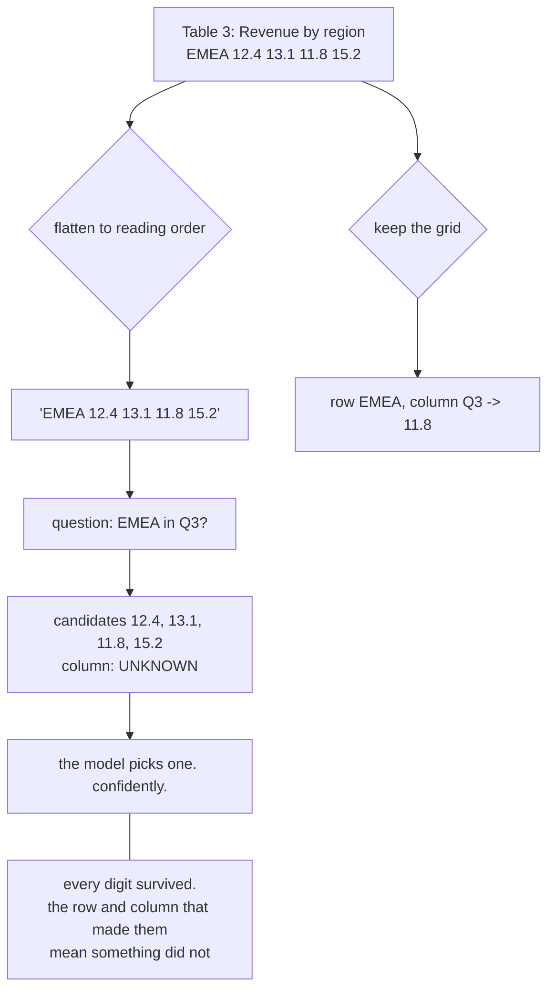
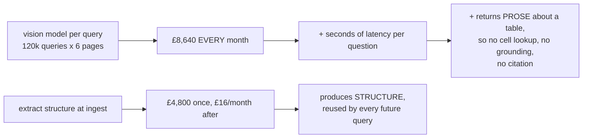
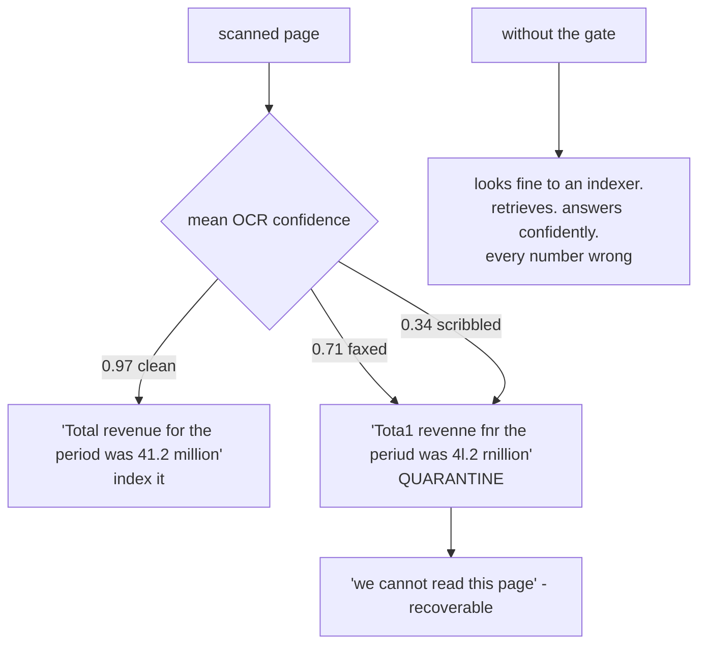
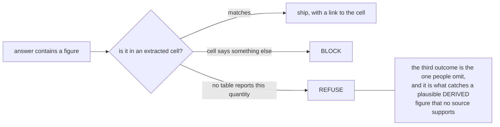

# Multimodal documents — diagrams

## 1. Ingest once, retrieve structure

---

## 2. The ceiling a text-only pipeline cannot exceed

---

## 3. A flattened table keeps the digits and loses the meaning

---

## 4. Where to pay: query time vs ingest

---

## 5. OCR confidence: wrong versus unknown

---

## 6. Numeric grounding has three outcomes, not two

