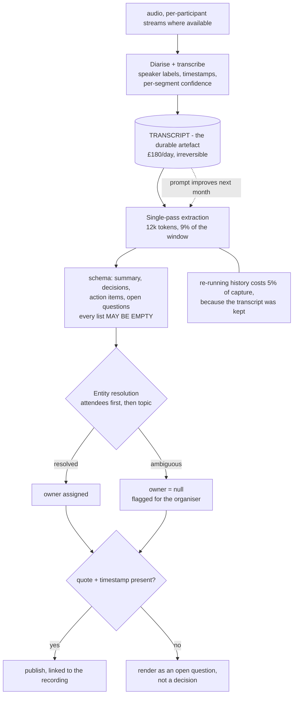
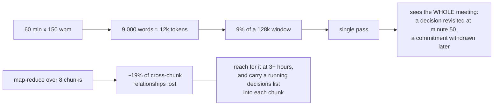
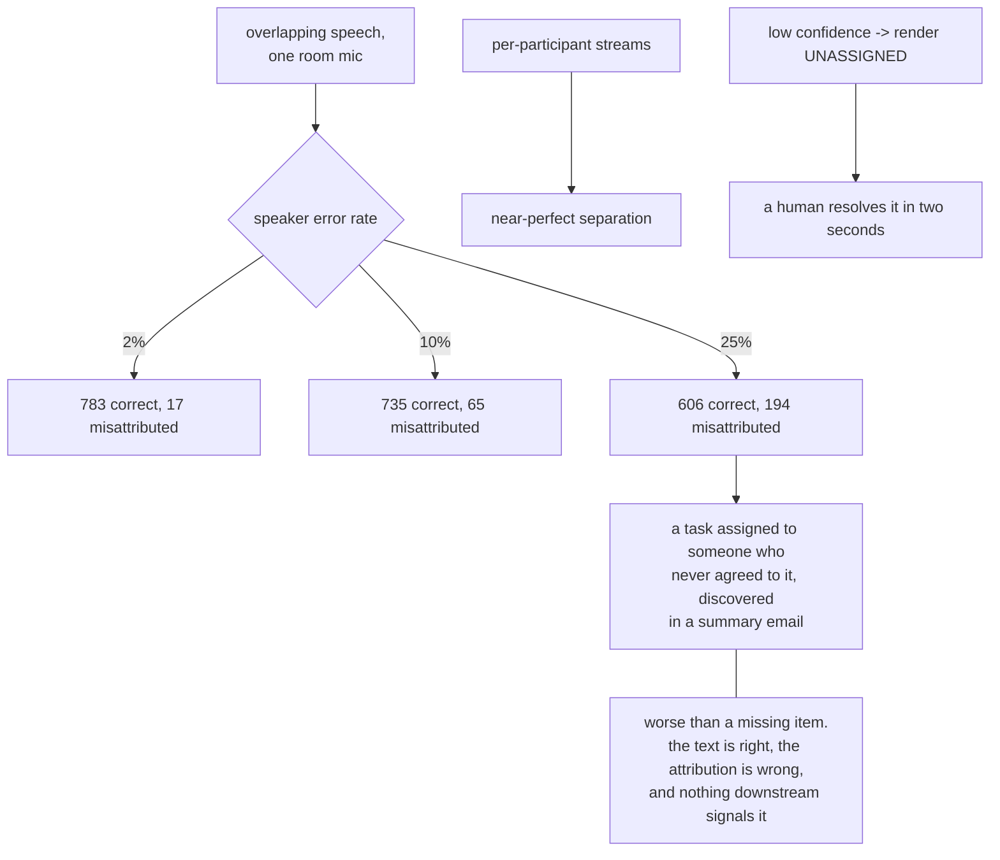
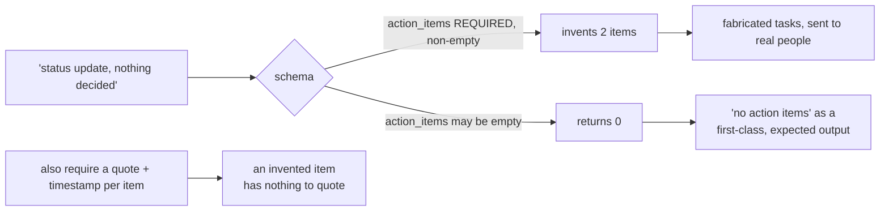
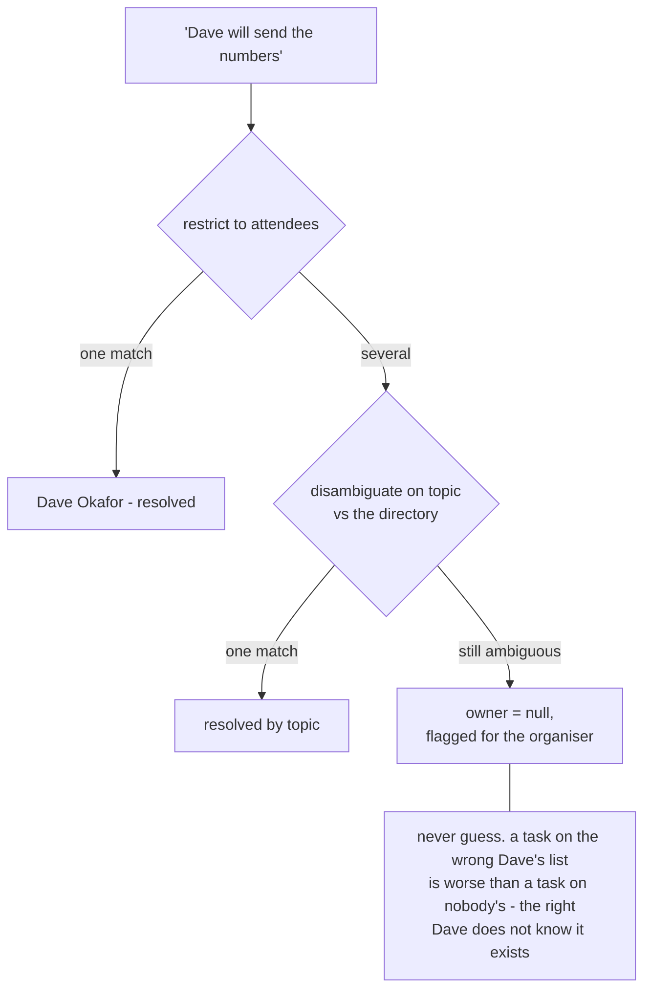
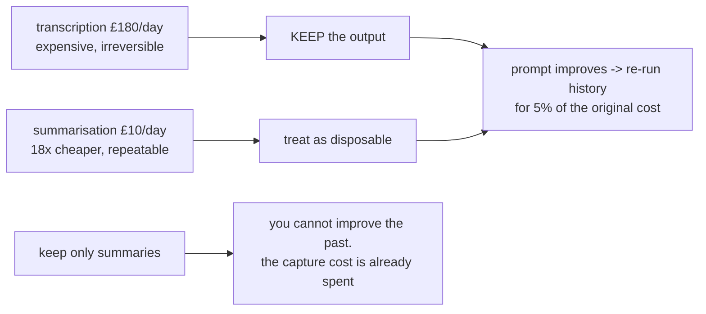

# Meeting notes — diagrams

## 1. Transcript is the artefact, summaries are derived

---

## 2. It fits — so do not chunk

---

## 3. Diarisation is load-bearing

---

## 4. A required list field is an instruction to invent

---

## 5. Which Dave?

---

## 6. Where the money is, and why it decides the design

