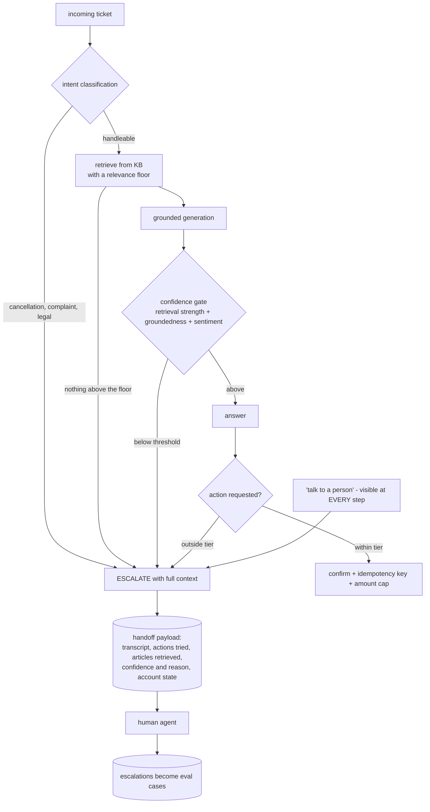
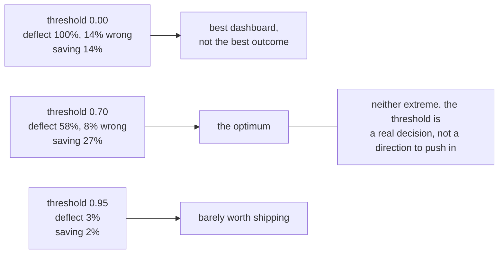
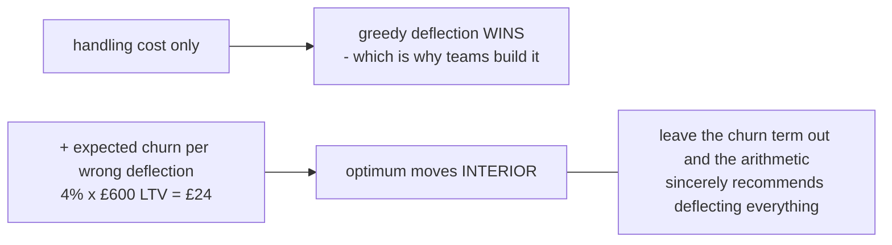
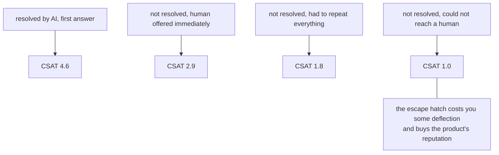
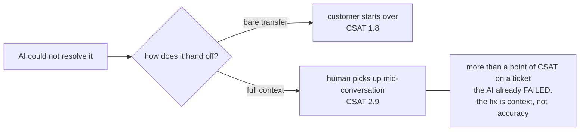
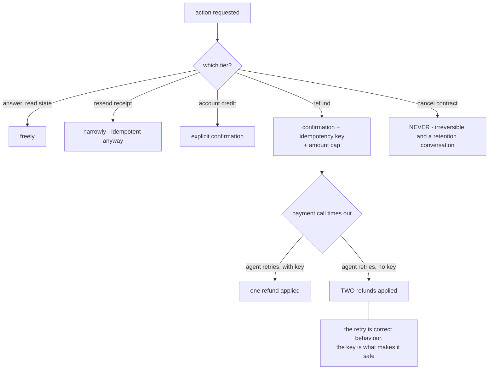
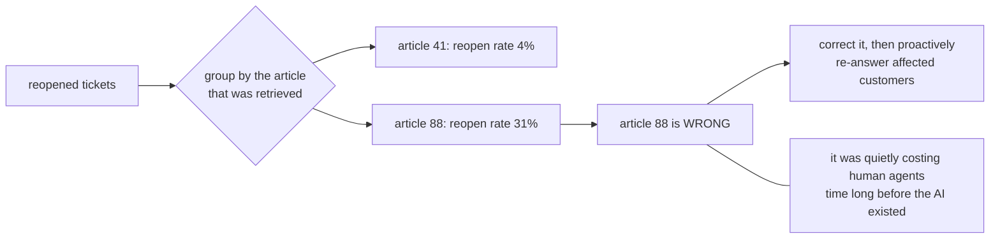

# Support copilot — diagrams

## 1. The request path

---

## 2. The optimum is interior

---

## 3. Trapping people is worse than saying no

---

## 4. Escalation is not the failure — a bad one is

---

## 5. Actions: tiered, confirmed, idempotent

---

## 6. Reopen clustering finds the wrong KB article

