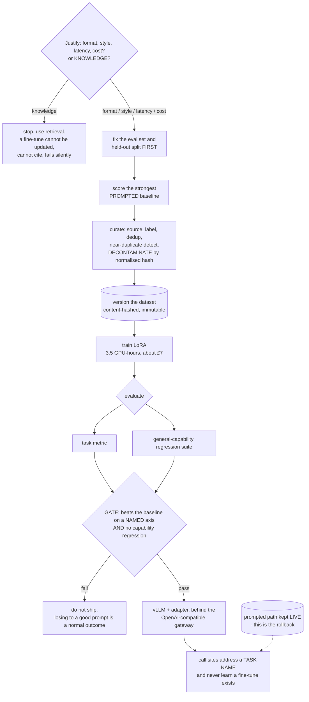
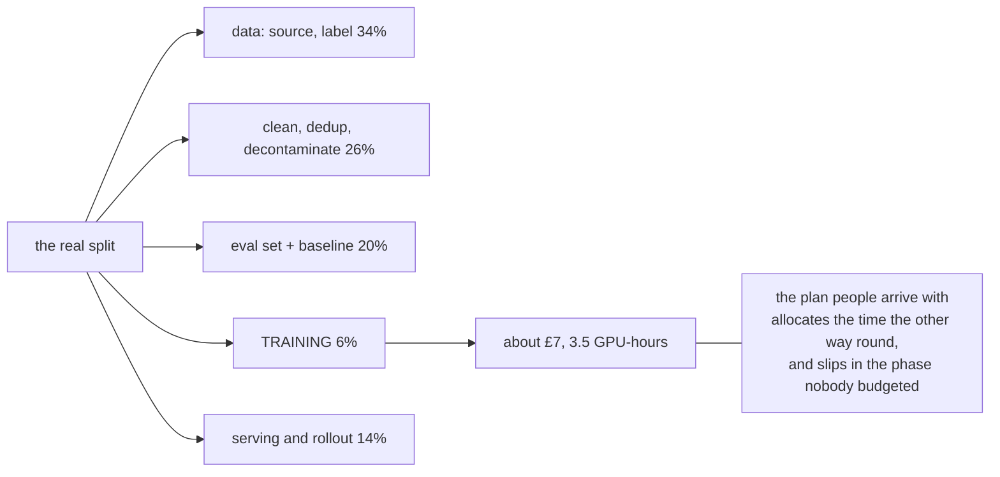
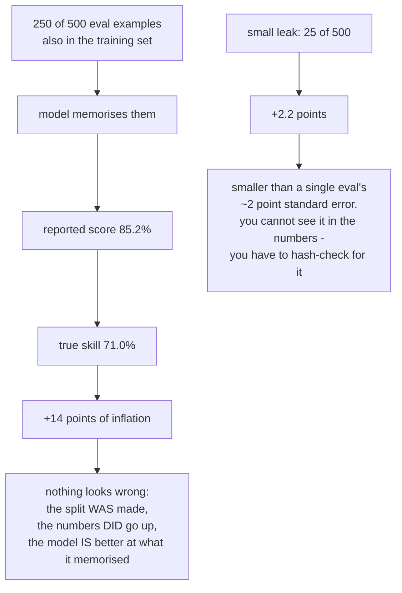
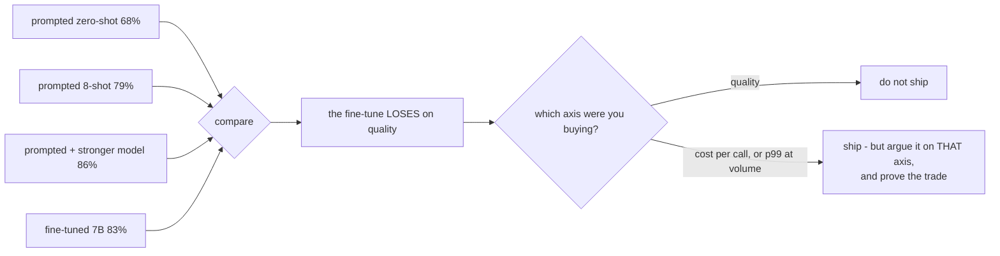
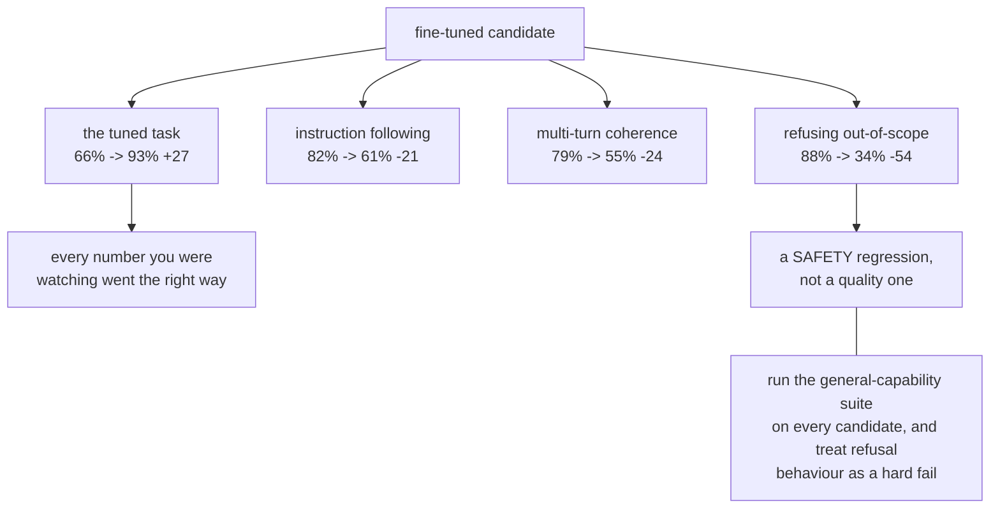
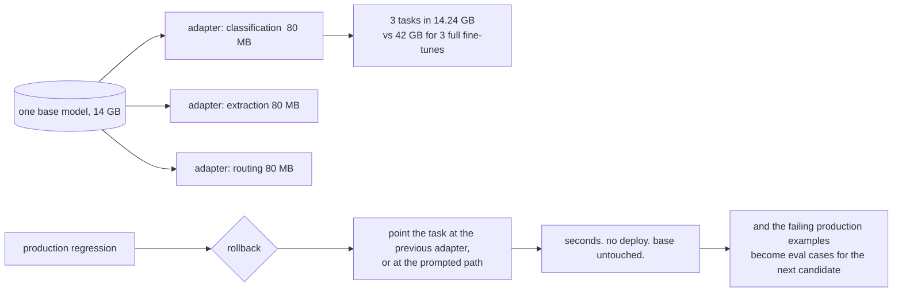

# Fine-tuning pipeline — diagrams

## 1. The pipeline, with the gate in the middle

---

## 2. Where the effort goes, against where people plan for it

---

## 3. Contamination does not look like a bug

---

## 4. The baseline is a gate you are allowed to fail

---

## 5. Catastrophic forgetting is invisible to the task metric

---

## 6. LoRA: swappable, and rollback is a pointer flip

