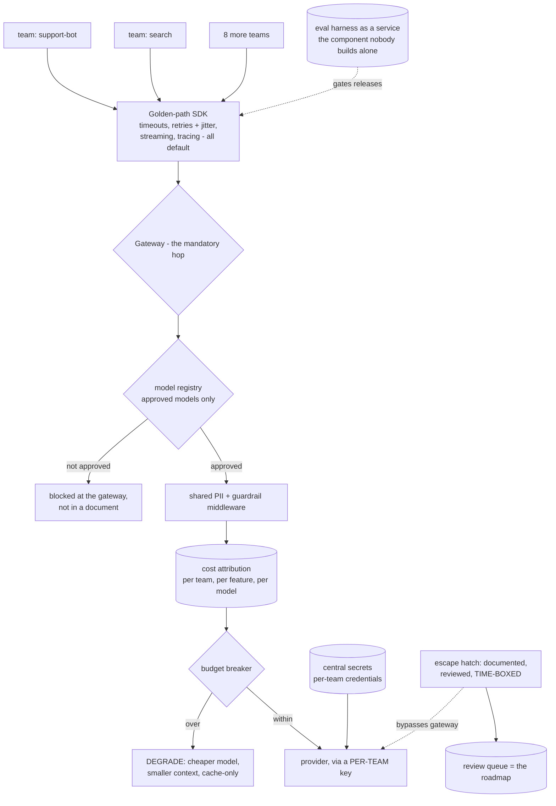
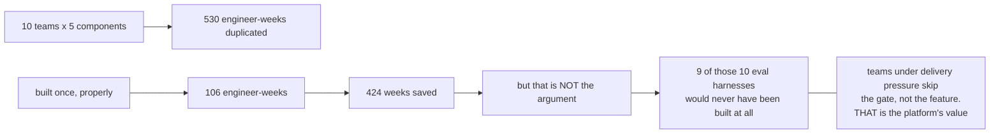
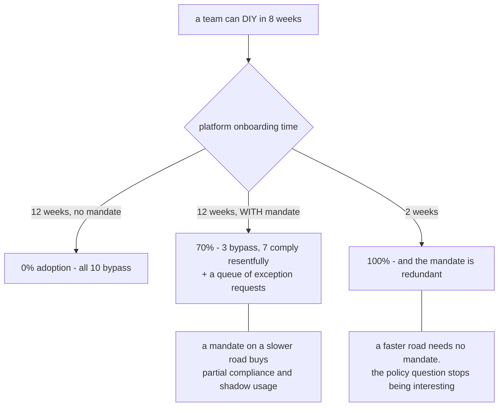
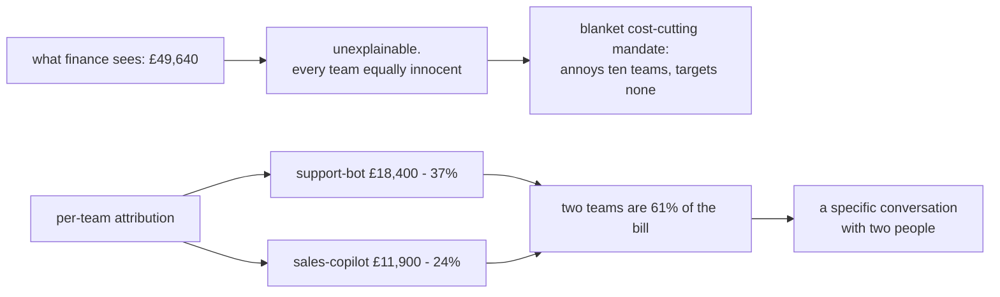
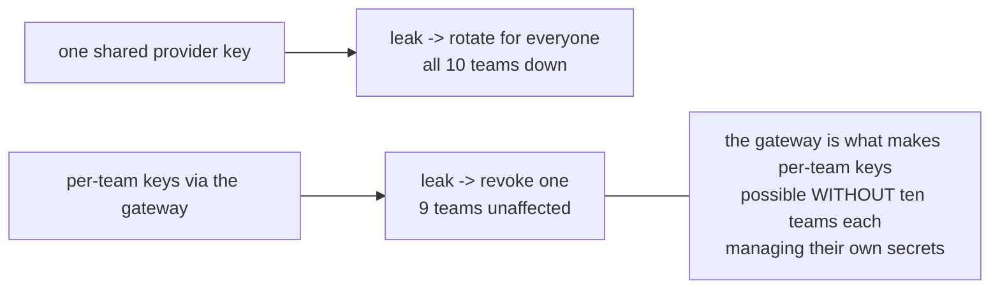
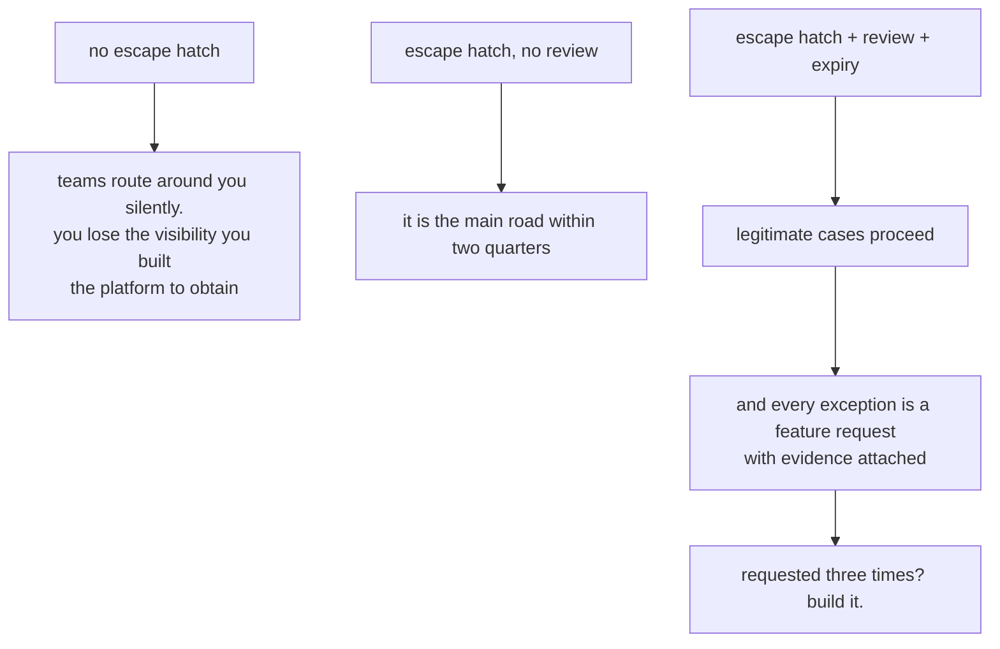

# Internal AI platform — diagrams

## 1. The platform

---

## 2. Ten implementations, nine of them wrong

---

## 3. The adoption arithmetic

---

## 4. Attribution changes who the conversation is with

---

## 5. Blast radius

---

## 6. The escape hatch, three ways

