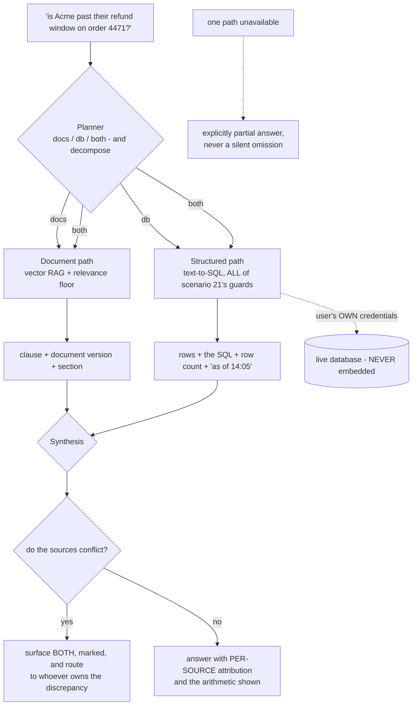
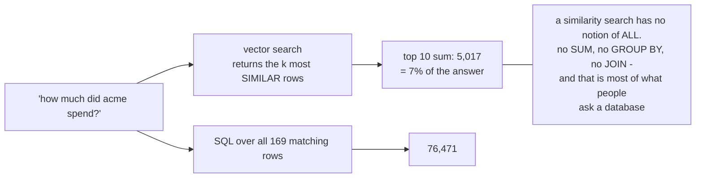
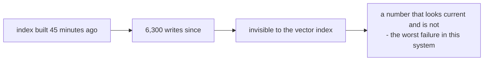
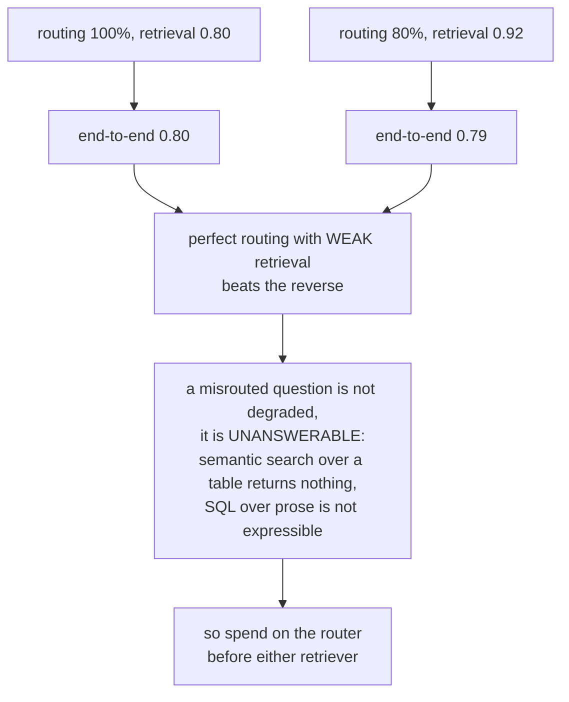
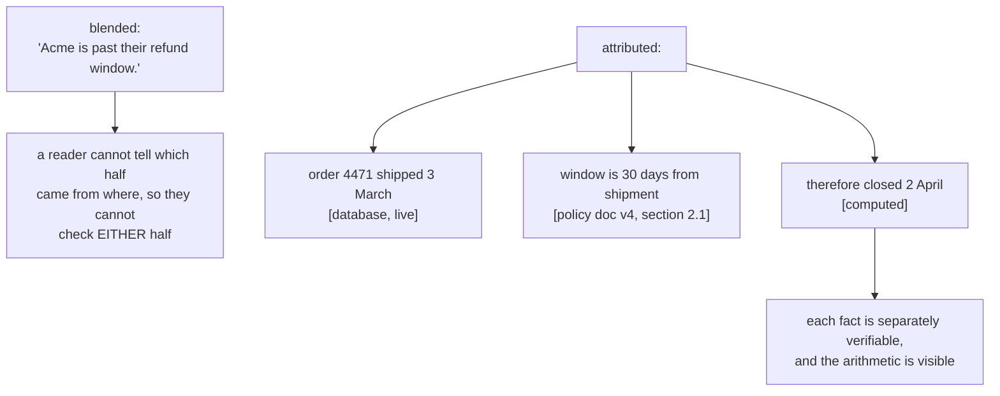
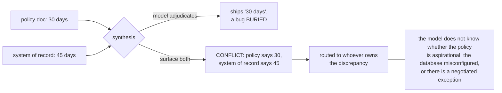
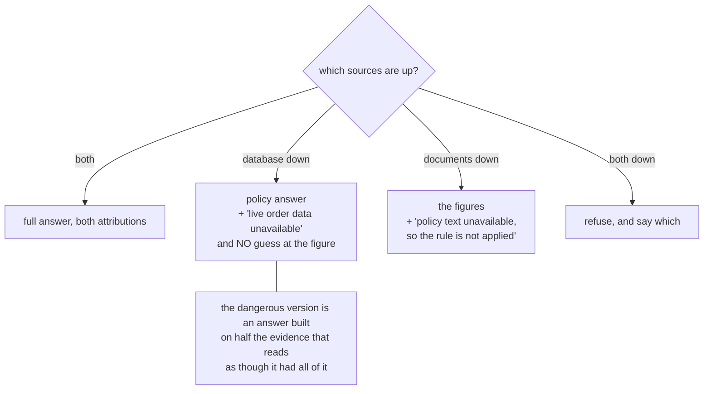

# Structured + unstructured RAG — diagrams

## 1. Two paths, one answer

---

## 2. Why you cannot embed the rows

---

## 3. Routing dominates

---

## 4. Attribution is what makes it checkable

---

## 5. Conflicts are detected, not resolved

---

## 6. Partial failure is the normal case

