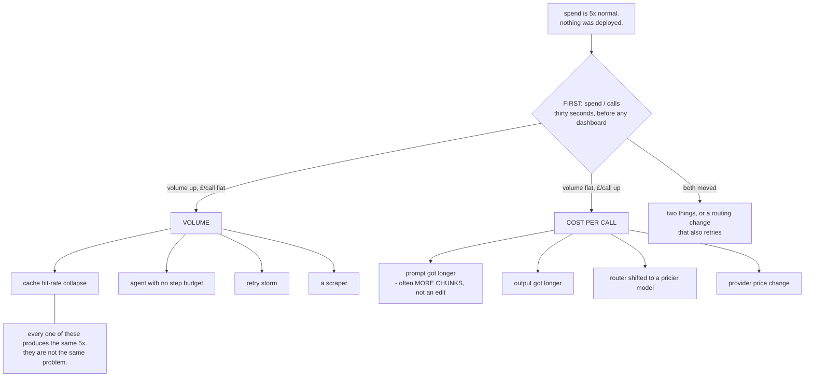
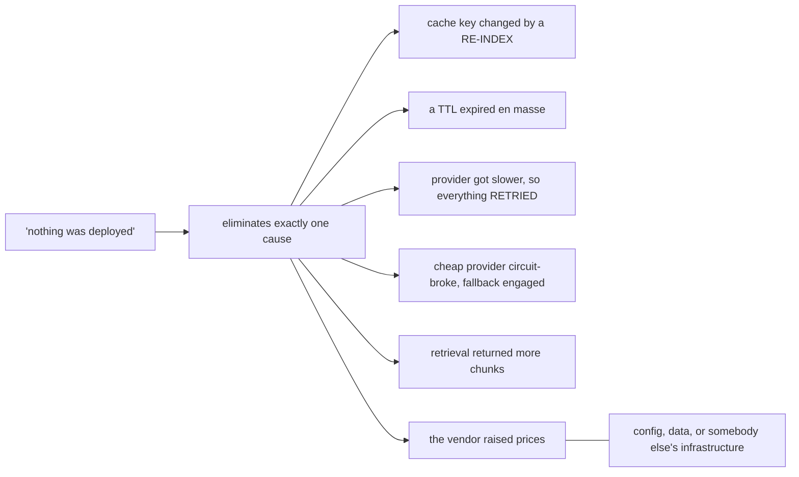
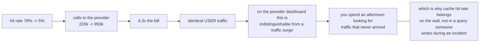
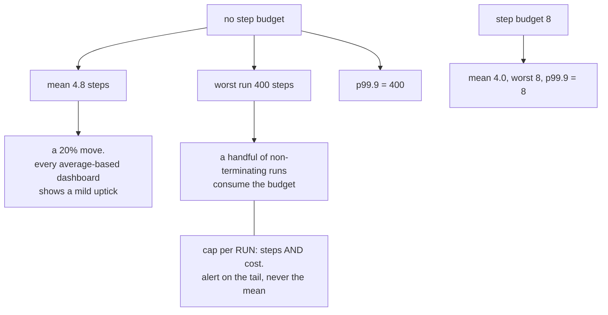
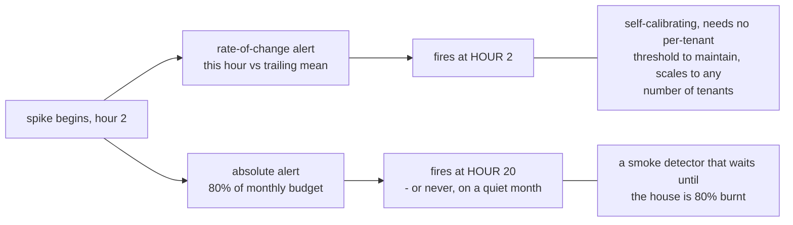
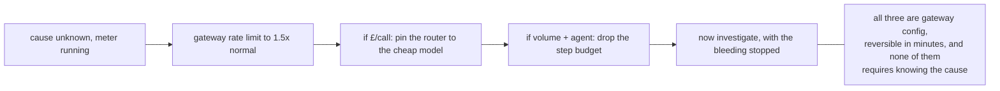

# The cost spike — diagrams

## 1. The bisection

---

## 2. None of them needed a deploy

---

## 3. The cache disguises itself

---

## 4. Agent loops hide in the tail

---

## 5. Alert on the derivative

---

## 6. Cap first, diagnose second

