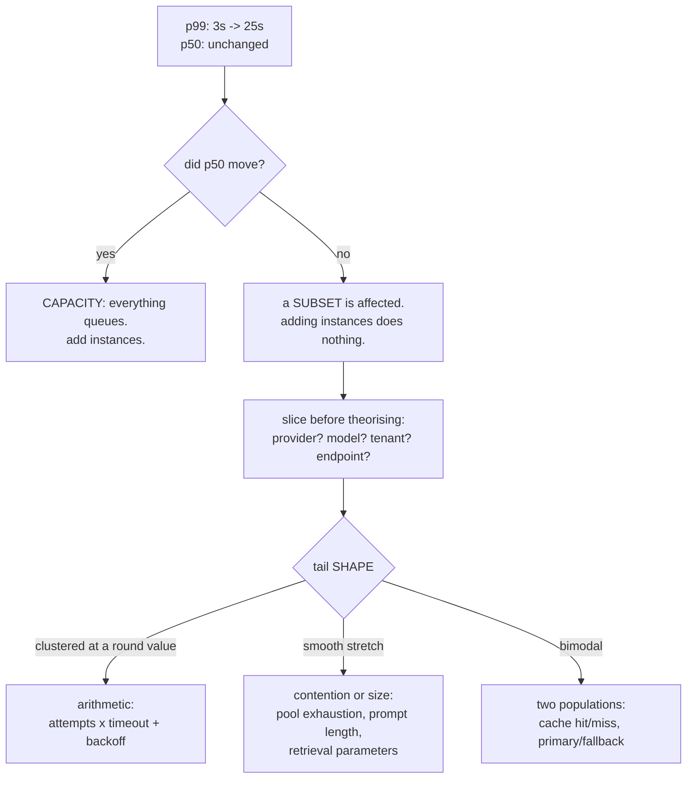
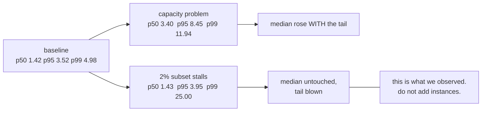
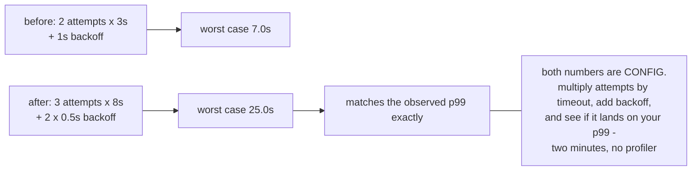
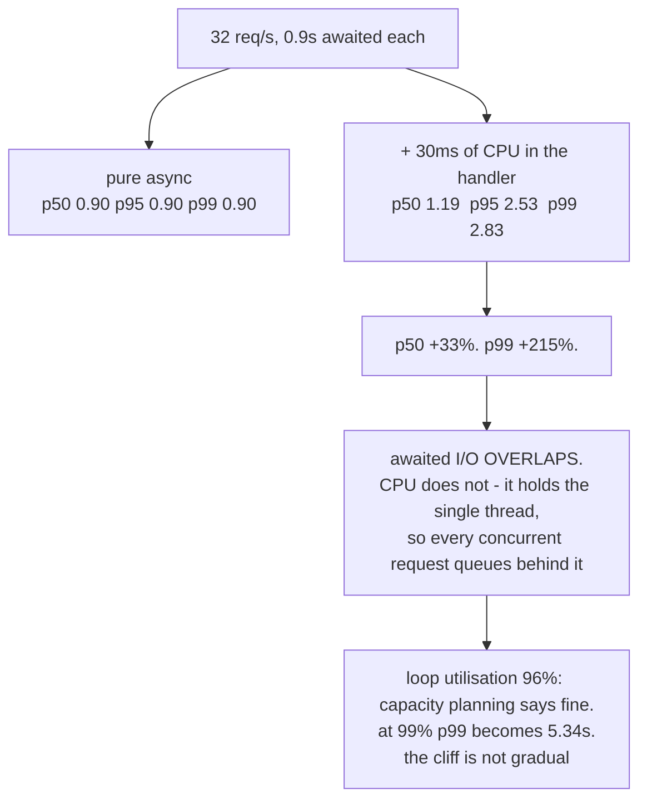
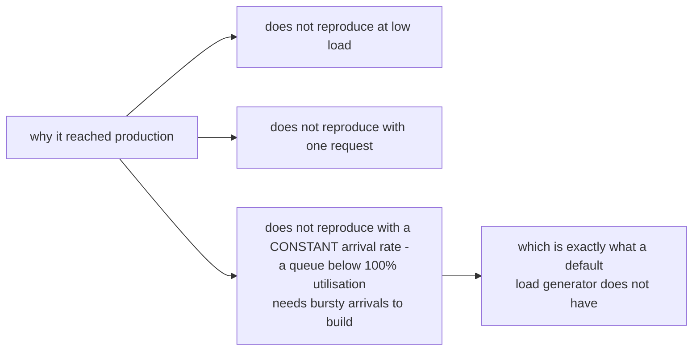
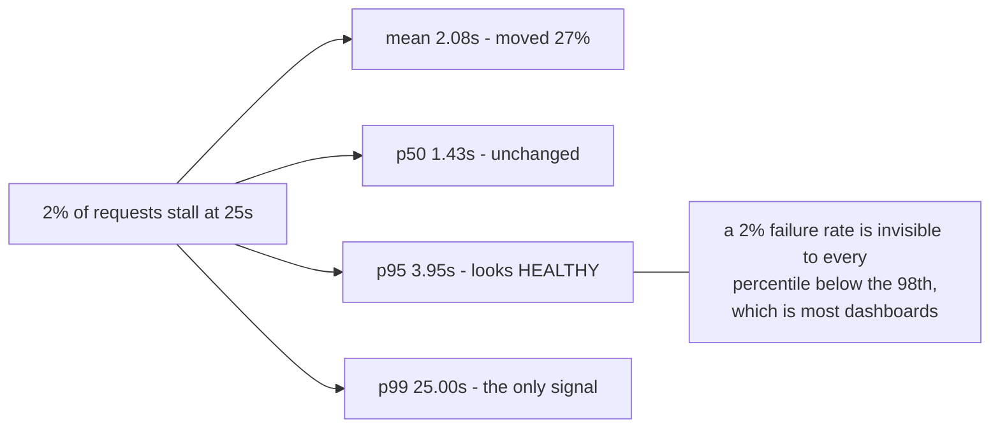
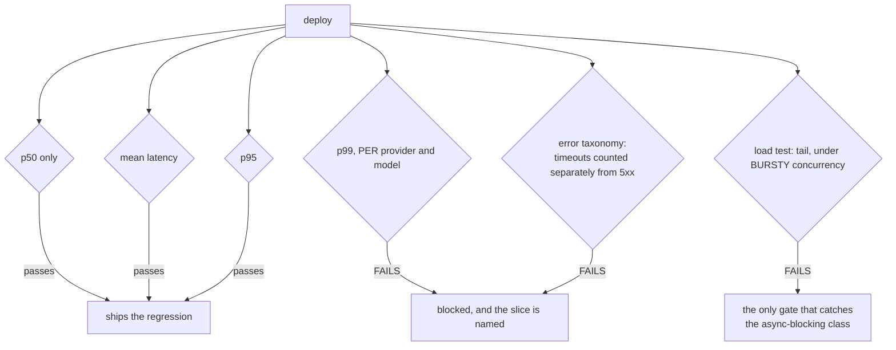

# The p99 blowout — diagrams

## 1. The observation that shapes the investigation

---

## 2. Capacity moves the median; a subset does not

---

## 3. Why 25 seconds is a suspiciously round number

---

## 4. A blocking call creates a queue, not latency

---

## 5. What the dashboard showed

---

## 6. The gate

